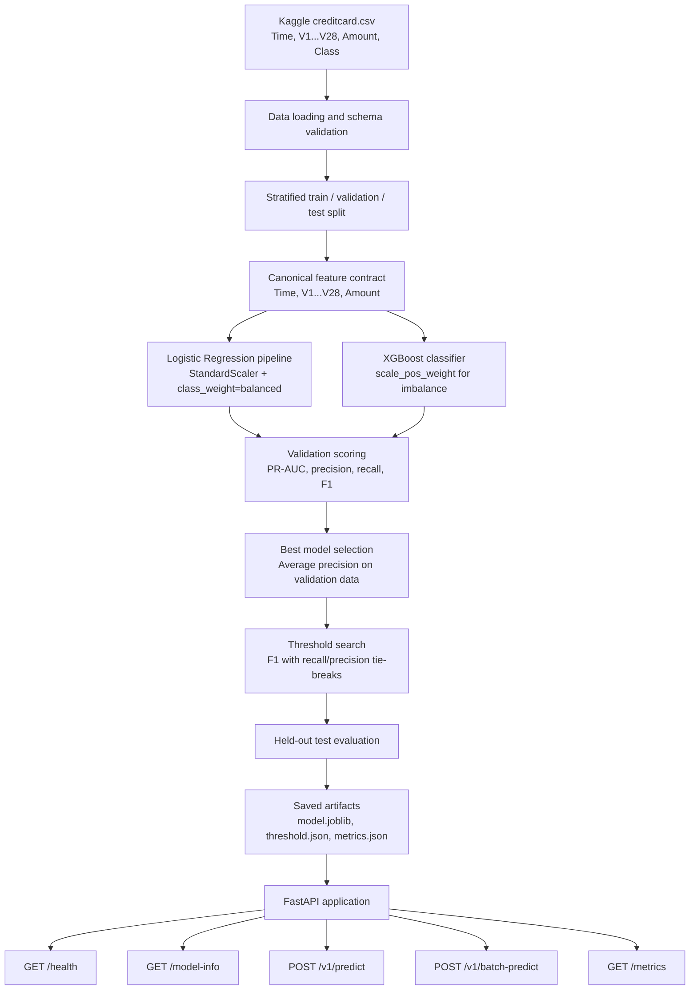

# SentryGuard — Real-Time Fraud Risk API

SentryGuard is a production-style machine learning API for real-time credit card
fraud risk scoring. It trains an interpretable Logistic Regression baseline and a
stronger XGBoost classifier on the Kaggle Credit Card Fraud Detection dataset,
selects a fraud-aware decision threshold, and serves predictions through FastAPI.

## Problem Statement

Credit card fraud is rare but expensive. The Kaggle dataset is severely
imbalanced, so a model that optimizes accuracy can look excellent while missing
the transactions that matter most. This project focuses on fraud-appropriate
metrics such as PR-AUC, recall, precision, F1, and the confusion matrix.

## What This Project Solves

- Trains two production-ready model candidates: Logistic Regression and XGBoost.
- Handles class imbalance with `class_weight="balanced"` and `scale_pos_weight`.
- Keeps validation and test data untouched by resampling or leakage.
- Saves a model artifact, threshold artifact, and metrics artifact from real
  training runs.
- Exposes real-time and batch prediction endpoints with typed Pydantic schemas.
- Includes tests, linting, type checking, Docker, Compose, CI, and pre-commit.

## System Design



## Workflow

1. Download the Kaggle dataset to `data/raw/creditcard.csv`.
2. Run the training pipeline.
3. Review `artifacts/metrics.json`.
4. Start the FastAPI app.
5. Score transactions through `/v1/predict` or `/v1/batch-predict`.

The Kaggle CSV uses capitalized feature names: `Time`, `Amount`, `V1` through
`V28`, and `Class`. The public API intentionally accepts lowercase JSON fields:
`time`, `amount`, `v1` through `v28`. The mapping is centralized in
`src/features/build_features.py` so training and serving always use the same
canonical model feature order.

## Tech Stack

- Python 3.12
- uv
- FastAPI and Pydantic
- scikit-learn
- XGBoost
- imbalanced-learn
- pandas and numpy
- joblib
- SHAP dependency included for future richer explanations
- pytest, httpx, pytest-cov
- ruff, mypy, pre-commit
- Docker and docker-compose
- GitHub Actions CI

## Dataset Setup

Create a Kaggle API token from your Kaggle account and place it outside this
repository, usually at `~/.kaggle/kaggle.json`.

```bash
mkdir -p data/raw
uv run kaggle datasets download -d mlg-ulb/creditcardfraud -p data/raw --unzip
```

Expected file:

```text
data/raw/creditcard.csv
```

## Local Setup on MacBook Air M3 / Apple Silicon

```bash
brew install git uv libomp wget
brew install --cask docker visual-studio-code

mkdir sentryguard
cd sentryguard
uv python install 3.12
uv init --package --python 3.12

uv add fastapi "uvicorn[standard]" pydantic pydantic-settings python-dotenv
uv add pandas numpy scikit-learn xgboost imbalanced-learn joblib shap
uv add loguru prometheus-fastapi-instrumentator
uv add kaggle
uv add --dev pytest pytest-cov httpx ruff mypy pre-commit bandit pip-audit
```

If you cloned this repository instead of initializing from scratch, run:

```bash
uv sync --all-groups
uv run pre-commit install
```

`libomp` is important on macOS Apple Silicon because XGBoost relies on OpenMP.

## Training

```bash
uv run python -m src.training.train --input data/raw/creditcard.csv
```

The training script writes:

```text
artifacts/model.joblib
artifacts/metrics.json
artifacts/threshold.json
```

Metrics are not pre-filled in this repository because they must come from your
actual training run. After training, open `artifacts/metrics.json` to see the
selected model, validation threshold, PR-AUC, ROC-AUC, precision, recall, F1,
accuracy, and confusion matrix.

## Run the API

```bash
uv run uvicorn app.main:app --reload --host 127.0.0.1 --port 8000
```

Swagger UI:

```text
http://127.0.0.1:8000/docs
```

Health check:

```bash
curl http://127.0.0.1:8000/health
```

If artifacts are missing, the API starts in a degraded state and prediction
endpoints return a clear `503` error. After training, `/health` reports
`model_loaded: true`.

## API Example

Request:

```bash
curl -X POST http://127.0.0.1:8000/v1/predict \
  -H "Content-Type: application/json" \
  -d '{
    "time": 10,
    "amount": 149.62,
    "v1": -1.359807, "v2": -0.072781, "v3": 2.536347,
    "v4": 1.378155, "v5": -0.338321, "v6": 0.462388,
    "v7": 0.239599, "v8": 0.098698, "v9": 0.363787,
    "v10": 0.090794, "v11": -0.5516, "v12": -0.617801,
    "v13": -0.99139, "v14": -0.311169, "v15": 1.468177,
    "v16": -0.470401, "v17": 0.207971, "v18": 0.025791,
    "v19": 0.403993, "v20": 0.251412, "v21": -0.018307,
    "v22": 0.277838, "v23": -0.110474, "v24": 0.066928,
    "v25": 0.128539, "v26": -0.189115, "v27": 0.133558,
    "v28": -0.021053
  }'
```

Response shape:

```json
{
  "fraud_probability": 0.873,
  "risk_level": "high",
  "decision": "review",
  "threshold": 0.72,
  "model_version": "xgb_v1.0.0",
  "top_risk_factors": null
}
```

Risk logic:

```text
fraud_probability < 0.30        -> low risk, approve
0.30 <= probability < threshold -> medium risk, monitor
probability >= threshold        -> high risk, review
probability >= 0.90             -> high risk, block
```

## Docker

```bash
docker build -t sentryguard:latest .
docker run --rm -p 8000:8000 sentryguard:latest
```

With Compose:

```bash
docker compose up --build
```

For prediction endpoints to work in Docker, train locally first so
`artifacts/model.joblib` and `artifacts/threshold.json` exist, or mount trained
artifacts into the container.

## Makefile Commands

```bash
make install
make lint
make typecheck
make test
make train
make run
make docker-build
make docker-run
```

## Model Evaluation Metrics

The project reports:

- Accuracy
- Precision
- Recall
- F1-score
- ROC-AUC
- PR-AUC / Average Precision
- Confusion matrix
- Selected threshold

PR-AUC, recall, precision, F1, and the confusion matrix are the primary fraud
metrics. Accuracy is included for completeness but is not the optimization goal.

## Production Standards Included

- Modular app, service, model loading, training, evaluation, and config layers
- Pydantic request and response schemas
- Environment-based configuration via `.env.example`
- Clear startup behavior when artifacts are missing
- Structured logging through the standard logging module
- Versioned prediction route at `/v1/predict`
- Batch prediction endpoint
- Prometheus `/metrics` endpoint
- Unit and API tests
- Ruff, mypy, pytest-cov, pre-commit
- Dockerfile and docker-compose
- GitHub Actions CI
- No committed secrets or Kaggle credentials

## Deployment Notes

Render and Railway can run the API as a web service with:

```bash
uv run uvicorn app.main:app --host 0.0.0.0 --port $PORT
```

Recommended deployment approaches:

- Train locally or in a separate job, then upload artifacts to the deployment
  environment.
- Store model artifacts in object storage for larger real systems.
- Keep Kaggle credentials out of the runtime API service.
- Use platform environment variables for `SENTRYGUARD_MODEL_PATH`,
  `SENTRYGUARD_THRESHOLD_PATH`, and `SENTRYGUARD_METRICS_PATH`.

## Future Improvements

- Add calibrated probabilities with `CalibratedClassifierCV`.
- Add SHAP-based explanations for XGBoost responses.
- Add drift monitoring for feature distributions and fraud rate.
- Add model registry support.
- Add request authentication for public deployment.
- Add async batch scoring backed by a queue for high-volume workloads.
- Add a scheduled retraining workflow.
